# Credit_Risk_Analysis

## Project Overview

Using a credit card dataset from LendingClub, a peer-to-peer lending services company, I oversampled the data using the RandomOverSampler and SMOTE algorithms, and undersampled the data using the ClusterCentroids algorithm. Then, I used a combinatorial approach of over- and undersampling using the SMOTEENN algorithm. Next, I compared two new machine learning models that reduce bias, BalancedRandomForestClassifier and EasyEnsembleClassifier, to predict credit risk. 

### Purpose

Evaluate the performance of the machine learning models I created and make a written recommendation on whether they should be used to predict credit risk.

## Resources

- Data Source: [Credit dataset from LendingClub](https://2u-data-curriculum-team.s3.amazonaws.com/dataviz-online/module_17/Module-17-Challenge-Resources.zip)
- Code: The code and results for this analysis is in the `credit_risk_ensemble.ipynb` and `credit_risk_resampling.ipynb` located within the `Notebook` folder.
- Software: JupyterNotebook, Python, Pandas
  
## Results

Balanced accuracy score and the precision and recall scores of all six machine learning models:

- **Naive Random Oversampling** 
  
  - high_risk precision score: 0.01
  - low_risk precision score: 1.00
  - high_risk recall score: 0.69
  - low_risk recall score: 0.60
  
    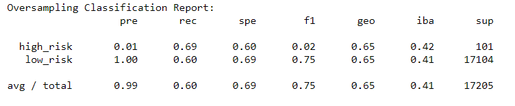
  - Balanced accuracy score:
    
    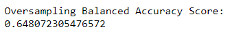

- **SMOTE Oversampling**
  
  - high_risk precision score: 0.01
  - low_risk precision score: 1.00
  - high_risk recall score: 0.63
  - low_risk recall score: 0.69
  
    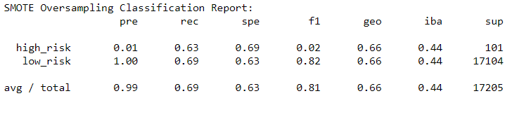
  - Balanced accuracy score:
    
    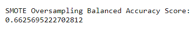

- **Cluster Centroids Undersampling**
  
  - high_risk precision score: 0.01
  - low_risk precision score: 1.00
  - high_risk recall score: 0.67
  - low_risk recall score: 0.42
  
    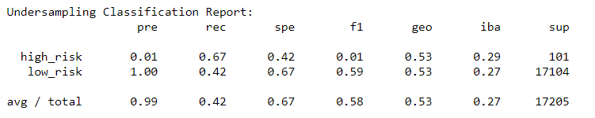
  - Balanced accuracy score:
    
    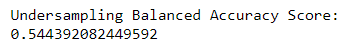

- **Combination (Over and Under) Sampling**
  
  - high_risk precision score: 0.01
  - low_risk precision score: 1.00
  - high_risk recall score: 0.72
  - low_risk recall score: 0.57
  
    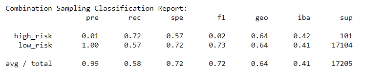
  - Balanced accuracy score:
    
    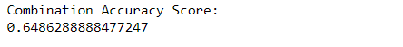

- **Balanced Random Forest Classifier**
  
  - high_risk precision score: 0.03
  - low_risk precision score: 1.00
  - high_risk recall score: 0.70
  - low_risk recall score: 0.87
  
    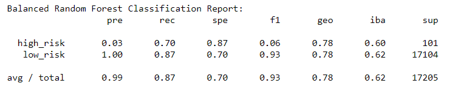
  - Balanced accuracy score:
    
    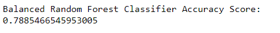

- **Easy Ensemble AdaBoost Classifier**

  - high_risk precision score: 0.09
  - low_risk precision score: 1.00
  - high_risk recall score: 0.92
  - low_risk recall score: 0.94
  
    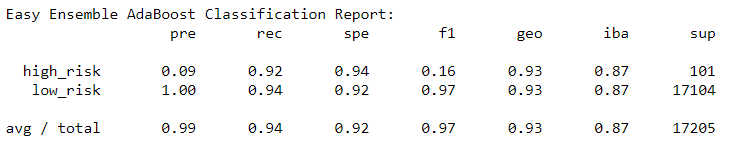
  - Balanced accuracy score:
    
    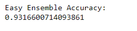

## Summary

Results show that the accuracy score for the majority of the models (SMOTE, Naive Random, Cluster, Combination) hovered around 0.65 or fell below that number. 
The Balanced Random Forest Classifier model's accuracy received a score of around 0.79 and the Easy Ensemble AdaBoost Classifier had an accuracy score of 0.93.

Though an accuracy score gives us an idea of how accurate a model is, with a higher accuracy score indicating a greater level of accuracy, it does not give the full picture, especially when using an imbalanced data set.

To get a deeper understanding of the effectiveness of our model, we need to look at the precision scores and the recall scores.

Precision is a measure of the reliability of a positive classification.

The precision scores for the SMOTE, Naive Random, Cluster and Combination models are the same with the high-risk precision score at 0.01 and low-risk score at 1.00. 
The Balanced Random Forest Classifier model's high-risk precision score fell at 0.03 and 1.00 for the low-risk precision score, whereas the Easy Ensemble AdaBoost Classifier had a high-risk precision score of 0.09 and a low-risk precision score of 1.00.

A low precision score is indicative of a large number of false positives. 
A high precision score such as 1.0 means that every mention that was labeled as belonging to that category does indeed belong to that classification; but a number of other true positives may not be predicted. 

The low precision scores we see in our results shows us where the machine-learning annotator created incorrect annotations. 

The precision score says nothing about how many other mentions that were labeled as a specific type by the human annotator were missed by the machine-learning annotator; the recall score reflects that information. 

The recall scores for the SMOTE, Naive Random, Cluster and Combination models are once again similar with the recall scores around 0.65. The Cluster model had a high-risk recall around 0.63 and a low-risk recall at 0.42. The recall scores were much higher for the Balanced Random Forest Classifier model (high-risk at 0.70 and low-risk at 0.87) and the Easy Ensemble AdaBoost Classifier (high-risk at 0.92 and low risk at 0.94).

Though the Random, Cluster, Combination and SMOTE models give some indications that they are useful, I would not recommend using these models because their accuracy score is fairly low along with recall score and the precision scores are both high and low.

More of an argument could be made to use the Balanced Random Forest Classifier and Ensemble AdaBoost Classifier, which have much higher recall and accuracy scores, but the split in precision scores indicates that these models are not perfect.

To make a more accurate model we may need more data, more cleaning, another model parameter, or try a different model. 